<div align="center">


### The **Apex Legends** config editor that unlocks what the game hides — and your community's **movement** hub.

<a href="https://github.com/izakk-exe/st1m-pot4l-by-idzy/releases/latest"></a>
<a href="https://izakk-exe.github.io/st1m-pot4l-by-idzy/"></a>


<a href="https://ko-fi.com/idzyy"></a>

<br><br>

<table>
<tr>
<td align="center">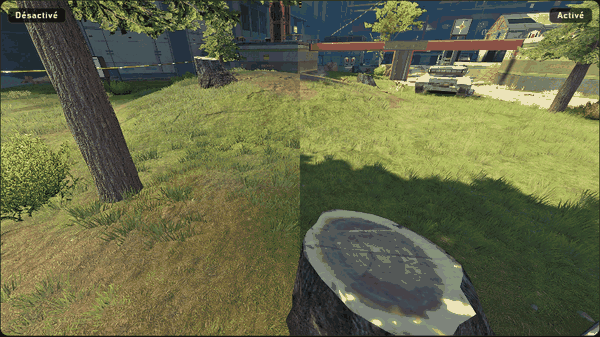<br><sub><b>Before / after</b> on real in-game captures</sub></td>
<td align="center">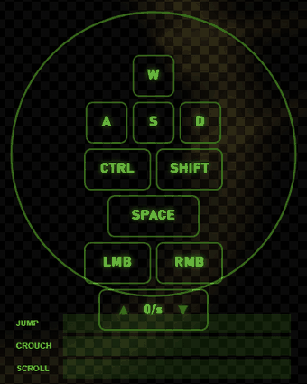<br><sub><b>Keyboard &amp; mouse</b> overlay</sub></td>
<td align="center">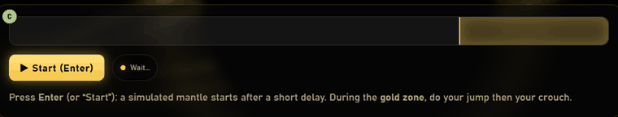<br><sub><b>Superglide Trainer</b></sub></td>
</tr>
</table>

</div>

---

## ⚡ In 3 clicks

1. **Download** the installer from the [Releases](https://github.com/izakk-exe/st1m-pot4l-by-idzy/releases/latest) page.
2. **Close Apex**, then launch **ST1M PORT4L**.
3. Click **"Apply the ST1M setup"** — FOV 120, magenta reticle, textures and shadows tuned. A backup is created and an **Undo** button stays within reach.

<p align="center">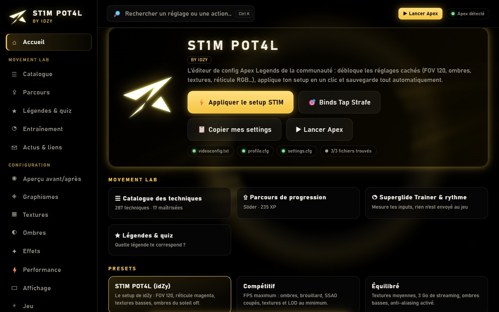</p>

---

## 🎛️ The config editor — everything Apex's menu won't let you do

<table>
<tr>
<td width="50%">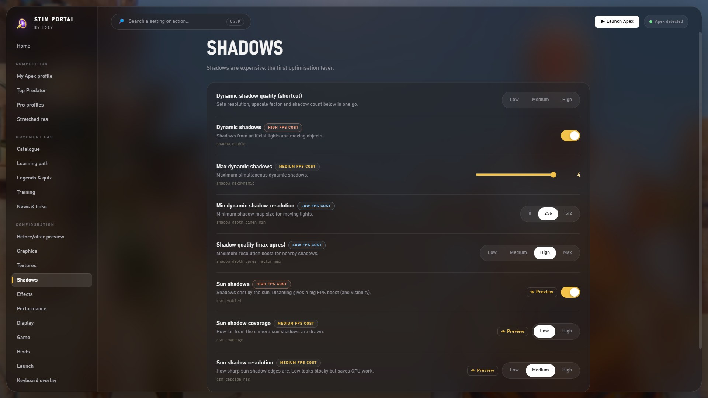</td>
<td width="50%">

- **40+ settings**: graphics, textures, shadows, effects, performance, display, FOV up to **120**, **RGB** reticle, NVIDIA Reflex…
- **Review before applying**: the exact list of what changes, with **per-setting undo** ↺
- **Presets**: ST1M, Competitive, Balanced, Ultra
- **Share codes** `SP1:` / `CE1:` — copy your setup, paste a friend's
- **Named profiles** (Ranked, LAN…) and `Ctrl + K` search
- **Automatic backups** (original + previous version) and **one-click restore**
- **Config lock** so Apex can't reset your settings
- **Stretched resolution**, launch options and a **▶ Launch Apex** button (Steam / EA app)

</td>
</tr>
</table>

### 👁️ See the effect before you apply it
Settings with real captures have a **Preview** button: drag the golden bar to compare **on real in-game captures** (sun shadows, SSAO, textures, LOD, decals, streaming…), with a short note on what it actually changes.

<p align="center">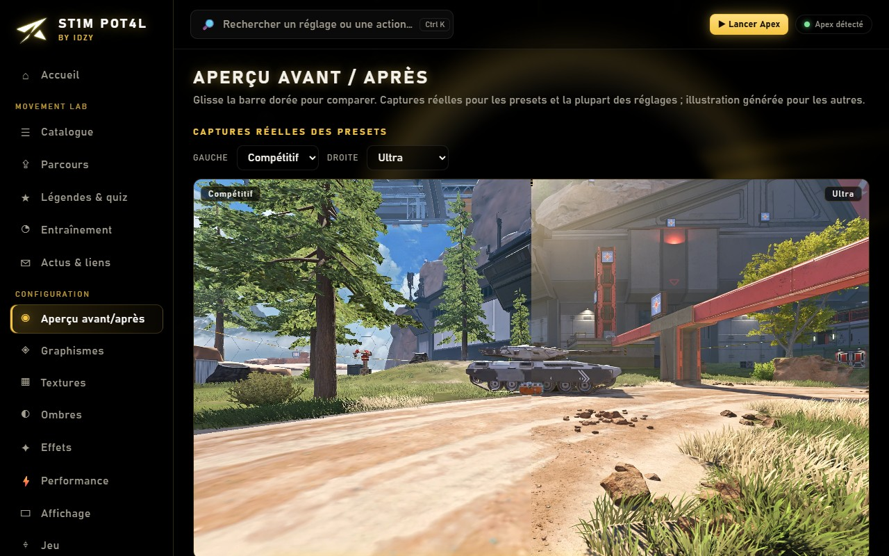</p>

---

## 🧭 Movement Lab — the movement hub

> **280+ movement techniques**, a learning path to progress, and trainers that measure your inputs.

<table>
<tr>
<td width="50%">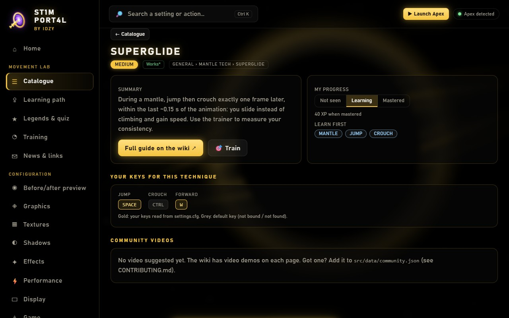<br><b>☰ Catalogue</b> — 287 techniques sorted by difficulty, showing <b>your own keys</b> read from <code>settings.cfg</code>, with a link to the full guide.</td>
<td width="50%">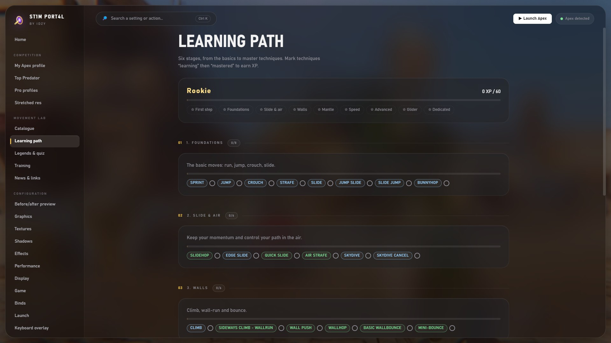<br><b>⇪ Learning path</b> — 6 stages, levels, XP and badges: from <i>Rookie</i> to <i>Apex Mover</i>.</td>
</tr>
<tr>
<td width="50%">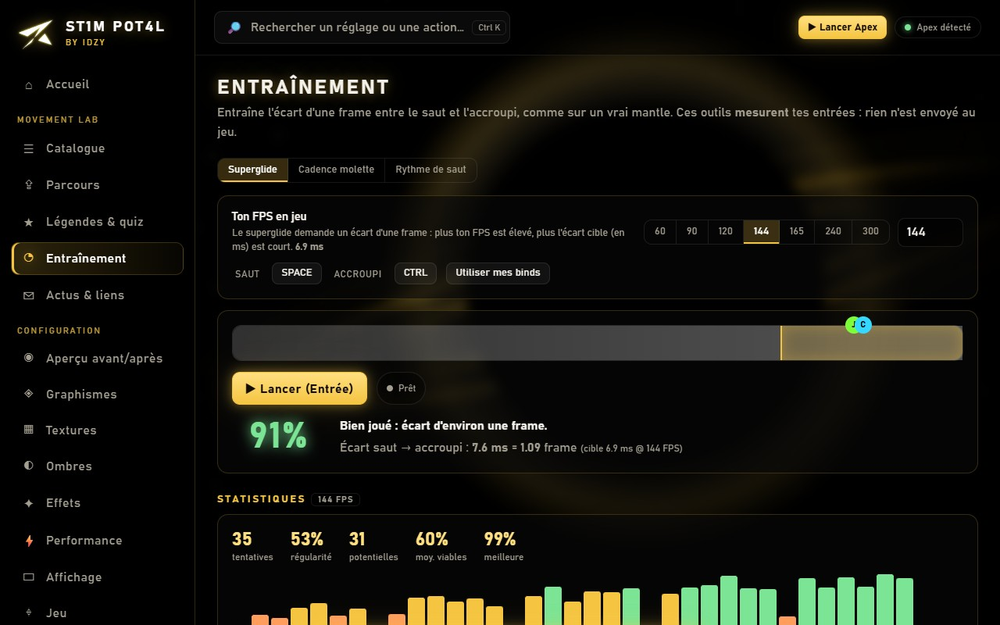<br><b>◔ Superglide Trainer</b> — the jump → crouch gap measured in frames, success chance, consistency and failure reasons. Plus wheel cadence (tap strafe) and jump rhythm trainers.</td>
<td width="50%">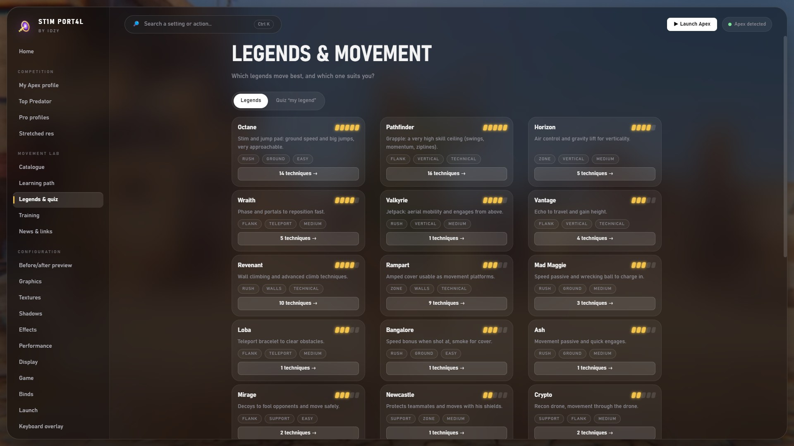<br><b>★ Legends &amp; quiz</b> — each legend's mobility, and a quiz to find the one that suits you.</td>
</tr>
</table>

### ◎ Keyboard & mouse overlay
**W A S D** light up as you play, a **ring surrounds the keys** and a dot follows **your mouse direction**. Optionally: Ctrl, Shift, Space, clicks, side buttons, a **mouse-wheel counter (ticks per second)** and a **jump / crouch / scroll timeline**. Colour, size, position and opacity are adjustable — perfect for clips and coaching. Shortcut: `Ctrl + Shift + O`.

<p align="center">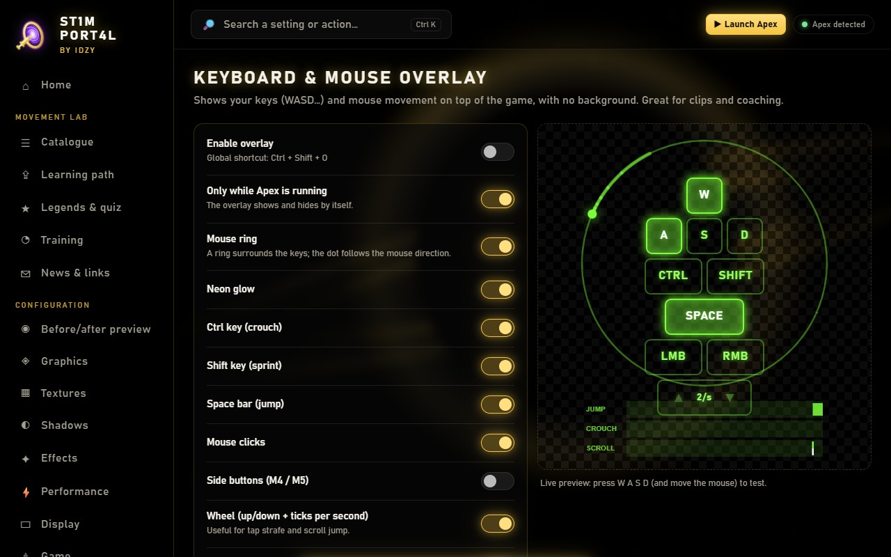</p>

### ⌨️ One-click bind packs
Tap strafe (wheel up/down = forward), scroll jump, superglide… Every key triggers **one normal in-game command**: **no macros, no input automation**.

<p align="center">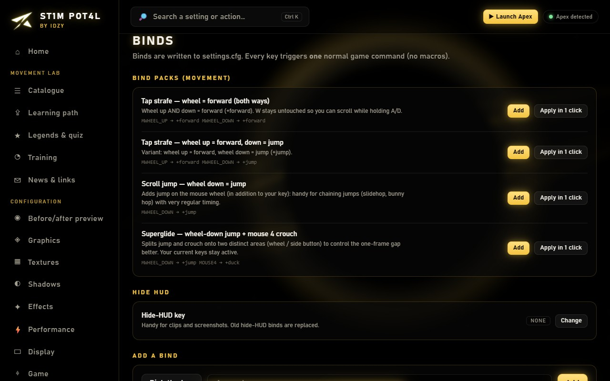</p>

---

## 🏆 Competition — stats, Predator, pro profiles, stretched res

- **My Apex profile** — enter your in-game name and see your rank, RP, level, ladder position, lifetime stats and an RP-over-time chart (history is stored locally).
- **Top Predator** — the Predator RP cut-off per platform and a live "RP left to Predator" gauge. Add friends, rivals or pros to a local RP ladder.
  Stats come from the [Apex Legends Status API](https://apexlegendsapi.com/) with **your own free API key**, stored encrypted on your PC. The free API has no global RP Top 500, and the Predator endpoint may not be open to every key (you can then type the cut-off by hand).
- **Pro profiles** — 11 keyboard-and-mouse players (movement specialists included: Faide, lyr1c, iiTzTimmy, Taxi2g, Leamonhead, YukaF, Mande, Stormen…) transcribed from public [ProSettings.net](https://prosettings.net/) pages: resolution, FOV, Reflex, graphics and movement keys, loaded into your draft in one click. Only settings the app can write *exactly* are applied; the rest is listed as "not applied". Source and date on every card.
- **Stretched resolution, no black bars** — pick a 4:3 / 16:10 profile and launch Apex from the app: it asks Windows + your graphics driver to stretch the resolution over the whole panel, then restores your display automatically when the game closes. No Steam command, no manual GPU-panel step (the resolution must be exposed by your driver, otherwise create it once as a custom resolution).

## 💾 Installation

| | |
|---|---|
| **Installer** (recommended) | `ST1M-PORT4L-Setup-x.y.z.exe` — updates itself from the app (*News & links → Check for updates*) |
| **Portable** | `ST1M-PORT4L-Portable-x.y.z.exe` — no installation, no automatic updates |

> **Windows shows "Windows protected your PC"?** That's expected: the app is unsigned (a code-signing certificate is expensive). Click **More info → Run anyway**. All the code is visible in this repository.

**Requirements**: Windows 10/11. For the **overlay**, set Apex to **Borderless** mode (it can't draw over exclusive fullscreen).

---

## 🔒 Trust & privacy

- **No account, no tracking.** The only network calls: an optional fetch of community news/statuses and the update check (both from GitHub) and — only if you add your own API key — your stats requests to the Apex Legends Status API.
- **Stretched resolution is temporary.** The app changes the display mode only for the game session (Windows reverts it when the helper ends) and restores it when Apex closes. Source: [`electron/display-stretch.ps1`](electron/display-stretch.ps1).
- **Automatic backups** before every change to your files (`%USERPROFILE%\Saved Games\Respawn\Apex`).
- **The overlay reads locally** only W A S D, Shift, Ctrl, Space, C, the mouse and the wheel — using the same mechanism as OBS input overlays (*Raw Input*). Nothing is recorded or sent. Source: [`electron/input-helper.ps1`](electron/input-helper.ps1).
- **The trainers measure; they never send anything to the game.**

> ⚠️ Community project, **not affiliated with EA / Respawn**. Editing config files is at your own risk. The app injects nothing into the game, but **no guarantee regarding EasyAntiCheat can be given**.

---

## ☕ Support the project

ST1M PORT4L is **free and ad-free**, and it will stay that way. If it helps you, you can support its development on **[Ko-fi](https://ko-fi.com/idzyy)**.
The current goal: a **Windows code-signing certificate** so the app installs without the "Windows protected your PC" warning. Anything beyond that goes to new features (leaderboards, weekly challenges, more movement guides).

<p align="center"><a href="https://ko-fi.com/idzyy"></a></p>

Not into donating? Starring the repo ⭐ and sharing it with your squad helps just as much.

---

## 🛠️ For developers

```bash
npm install
npm start      # run the app
npm run web    # web demo on http://localhost:8765
```

Windows build: `npm run dist` (admin or Developer Mode) or `scripts/build-win-local.ps1`.
Community content (per-season statuses, videos, news): see [`CONTRIBUTING.md`](CONTRIBUTING.md) — a simple pull request on `src/data/community.json`.

## 🙏 Credits

- **[Config Editor for Apex Legends](https://codeberg.org/configeditor/config-editor)** (MIT) — inspiration, setting values and comparison images.
- **[Apex Movement Wiki](https://apexmovement.tech)** — the Movement Lab's technique index links to their guides. Go check them out, they do incredible work.
- Details in [`NOTICE.md`](NOTICE.md) · [MIT](LICENSE) licensed © idZy.

<div align="center"><sub><b>ST1M PORT4L</b> by idZy — made by players, for players.</sub></div>
