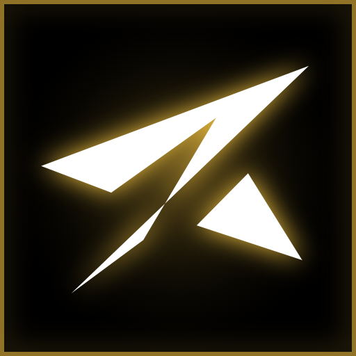

<p align="center"></p>

# ST1M POT4L — by idZy

Éditeur de config **Apex Legends** pour la communauté : débloque les réglages que le menu du jeu cache
(FOV jusqu'à 120, ombres du soleil, textures, réticule RGB, Reflex…), applique un setup complet **en 1 clic**,
et sauvegarde tout automatiquement.
*Community Apex Legends config editor: hidden settings, one-click setup, tap-strafe binds, automatic backups.*

**Télécharger :** [Releases](https://github.com/izakk-exe/st1m-pot4l-by-idzy/releases/latest) · **Démo web :** https://izakk-exe.github.io/st1m-pot4l-by-idzy/

## Fonctionnalités / Features

| | |
|---|---|
| ⚡ **Setup ST1M en 1 clic** | applique le setup de idZy (FOV 120, réticule magenta, textures basses…) avec sauvegarde auto + bouton *Annuler* |
| 🎯 **Binds Tap Strafe en 1 clic** | molette haut/bas = `+forward` (ou variante molette bas = saut). Une touche = une commande, **aucune macro** |
| 📋 **Copier mes settings** | génère un code `SP1:…` de tes réglages actuels (compatible import/export des codes `CE1:…`) |
| 40+ réglages | Graphismes, Textures, Ombres, Effets, Performance, Affichage, Jeu (FOV, réticule, audio, télémétrie, NVIDIA Reflex) |
| 👁 **Aperçus avant/après** | bouton « Aperçu » sur chaque réglage + onglet comparateur (glisse la barre) pour voir l'effet : ombres, SSAO, brouillard, textures, FOV, réticule… Vraies captures du jeu (images du projet MIT Config Editor, voir `NOTICE.md`), illustration générée pour les réglages sans capture |
| ◎ **Overlay clavier & souris** | affiche W A S D (+ Maj, Ctrl, Espace, clics) au-dessus du jeu, sans fond, avec un cercle qui entoure les touches et un point qui suit la souris. Couleur, taille, position, opacité réglables ; raccourci `Ctrl+Maj+O` ; s'affiche seulement quand Apex tourne (mode **Sans bordure** requis) |
| ▶ **Lancer Apex** | bouton dans la barre du haut : Steam, EA app ou exécutable, avec tes options de lancement et proposition d'appliquer les changements avant |
| ☰ **Movement Lab — Catalogue** | 287 techniques (index du Apex Movement Wiki) filtrables par difficulté, légende, famille, statut et progression, avec **tes propres touches** lues dans `settings.cfg` et lien vers le guide complet |
| ⇪ **Parcours de progression** | 6 étapes, niveaux, XP et badges |
| ★ **Légendes & quiz** | fiches de mobilité par légende et quiz « quelle légende pour moi » |
| ◔ **Entraînement** | Superglide Trainer (écart saut/accroupi à l'image près, % de réussite, stats), cadence de molette (tap strafe), rythme de saut — ils *mesurent* tes inputs, rien n'est envoyé au jeu |
| ⌨ **Packs de binds** | tap strafe, scroll jump, superglide en 1 clic |
| ✉ **Actus & mises à jour** | fil d'actus, statuts par saison et vidéos fournis par la communauté (`src/data/community.json`), mise à jour automatique via les releases GitHub |
| Presets | ST1M, Compétitif, Équilibré, Ultra |
| Révision avant application | liste des changements avec annulation individuelle ↺ |
| Binds | gestionnaire de binds, touche « masquer le HUD », capture de touche/molette |
| Options de lancement | `-novid`, `+lobby_max_fps 0`, `-no_render_on_input_thread`, `+fps_max`, résolution étirée… |
| Résolution étirée | 16:10 / 4:3 / 5:4 en 3 niveaux de qualité |
| Profils | sauvegarde/chargement/partage de configs nommées |
| Sauvegardes | `.st1m.bak` (original) + `.st1m.last.bak` (version précédente), restauration en 1 clic |
| Verrou de config | `videoconfig.txt` en lecture seule pour qu'Apex ne le réinitialise pas |
| Recherche `Ctrl+K` | réglages, pages et actions |
| FR / EN, fond animé flou | fond « trou noir » animé, ou ta propre image, ou désactivé |

Fichiers modifiés (`%USERPROFILE%\Saved Games\Respawn\Apex`) : `local\videoconfig.txt`, `profile\profile.cfg`, `local\settings.cfg`.
Aucun compte, aucun cloud, aucune télémétrie.

## Installer / Build

```bash
npm install
npm start          # lance l'app
npm run dist       # génère l'installeur + version portable dans dist/ (Windows, nécessite le mode développeur ou admin)
# sans privilèges :  powershell -File scripts/build-win-local.ps1
```

Une version **web de démonstration** (mode démo, ou édition réelle via Chrome/Edge en choisissant le dossier Apex)
est dans `src/` : `npm run web` puis http://localhost:8765.

### Publier sur GitHub
1. Crée le dépôt et pousse le code sur `main` (le workflow *Web demo* publie `src/` sur GitHub Pages — active Pages → Source : *GitHub Actions*).
2. Crée un tag `v1.0.0` : le workflow *Release* build l'installeur Windows et l'attache à la release.

## Codes de partage
`CE1:`/`SP1:` + base64url(zlib(JSON)). `CE1` = `{v, fov, reticle, settings}` ; `SP1` ajoute `x:{profile, settings, binds}`.
Les codes importés sont validés (clés connues uniquement, valeurs bornées).

## Overlay : comment ça marche
Un petit assistant PowerShell (`electron/input-helper.ps1`) lit les entrées via *Raw Input* de Windows (même mécanisme que les overlays OBS).
Il ne transmet que W A S D, Maj, Ctrl, Espace, C, les boutons de souris et le déplacement relatif de la souris ; toute autre touche est ignorée et rien n'est enregistré ni envoyé.
Certains antivirus peuvent signaler ce type de script : c'est le code source que tu peux lire. Apex doit être en mode **Sans bordure** pour que l'overlay s'affiche.

## Avertissement
Projet communautaire non affilié à Respawn / EA. Modifier ses fichiers de config est à tes risques ; des sauvegardes sont créées
automatiquement. Les valeurs des réglages suivent celles du projet Config Editor et peuvent évoluer avec les mises à jour du jeu. Le tap strafe est fourni sous forme de **binds standards** uniquement.

## Licence
MIT — voir [LICENSE](LICENSE). Inspiré par *Config Editor for Apex Legends* (MIT) ; code entièrement réécrit.
